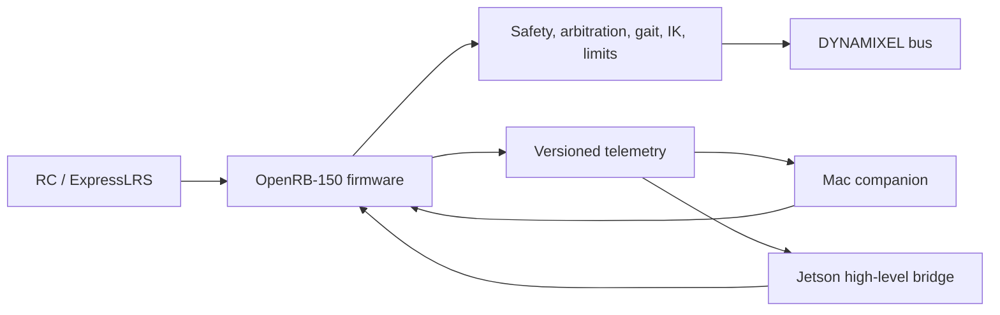

# Developer Guide

This guide explains the ownership boundaries and repeatable workflows for
firmware, host tooling, simulation, and Jetson work. It complements the
[operator guide](operator_guide.md); it does not replace physical HIL evidence.

## Architecture and Ownership



The OpenRB-150 owns arming, disarming, emergency stop, DYNAMIXEL power,
torque, safety/fault transitions, command-source arbitration, gait timing, IK,
servo limits, and final goal validation. The Mac and Jetson are clients.

- `task_control` consumes bounded snapshots and creates high-level servo goals.
- `task_dxl` is the only owner of `Serial1` and DYNAMIXEL operations.
- `task_i2c` is the only owner of `Wire`, the TCA9548A, foot sensors, and the
  24LC32 EEPROM.
- `task_rc_crsf` is the only owner of `Serial3` CRSF input.
- `task_api` is the only USB frame parser/writer.

Do not add direct servo writes to a host client, ROS node, callback, or new
firmware task. Cross-task data must remain bounded and nonblocking.

## Local Quality Gates

Use the root recipes before asking for a hardware test:

```bash
just protocol-test
just companion-test
just jetson-test
just firmware-test
just lint
just typecheck
just check
```

`just check` runs all hardware-free suites, the clean lint/type-check gates,
and an OpenRB-150 build. The GitHub workflow in
`.github/workflows/quality.yml` also compiles the output-disabled HIL image.
See [testing.md](testing.md) for command details and CI coverage.

## Firmware and Protocol Changes

The public USB API is COBS-framed and CRC16-protected. Keep schema changes
versioned, append-only where compatibility permits, and update both reference
and native golden-vector coverage whenever wire behavior changes.

```bash
cd protocol
uv run --project python --extra dev pytest tests
uv run --project python --extra dev pyright python/hexapod_protocol
uvx ruff check python/hexapod_protocol tests
```

The [protocol reference](../protocol/README.md) defines frame layout and test
vectors. `companion/src/transport/protocol_client.py` is the shared threaded
host transport; the CLI, UI, and Jetson bridge should reuse it rather than
creating another framing or response-correlation implementation.

## Configuration and Calibration Data

`RobotConfig` is the fixed-width persistent configuration contract. It stores
servo mapping/sign/trim/travel, leg geometry, gait defaults, feature defaults,
and foot-sensor calibration. Firmware validation is authoritative; host-side
validation only gives earlier operator feedback.

Treat the EEPROM as a transactional store:

1. Load the current configuration into a RAM shadow.
2. Stage and validate changes while the robot is safe.
3. Commit only on explicit request, never during active walking.
4. Read back and log logical DXL parameter changes.

The 24LC32 is optional at boot. Its absence must select compiled safe defaults,
mark configuration volatile, and reject persistent commit without preventing
safe disarmed operation.

## Simulation and URDF

The ROS 2 Jazzy workspace lives in `robot_ros_simulation/`. It is a software
in-the-loop adapter around the Arduino-free `ControllerCore`, not a hardware
bridge:

```bash
cd robot_ros_simulation
just build
just sil-launch
```

The canonical 18-joint naming and unit/authority boundary are documented in
[ros2_controller_interface_mapping.md](ros2_controller_interface_mapping.md).
The flattened URDF used by the companion and ROS display is
`robot_ros_simulation/HexNav_description/urdf/HexNav.urdf`.

ROS and URDF views are calibration diagnostics. They must not be used to infer
physical joint sign, zero, or frame alignment without a controlled physical
verification.

## Jetson Boundary

`jetson/src/hexapod_jetson_bridge/` is a pure-Python high-level serial bridge.
It sends only the distinct Jetson heartbeat plus gait, gait-parameter, body
twist, body-pose, stop, and telemetry-subscription requests. It has no
raw-servo, torque, arming, or DXL register API.

Firmware grants Jetson authority only when its feature flag is enabled, the RC
is armed, the RC autonomy switch permits it, and the Jetson heartbeat is fresh.
RC kill/disarm and firmware faults always win. ROS 2 publisher/subscriber work
uses the optional `hexapod_jetson_bridge.ros2_node` adapter, launched from the
RoboStack Jazzy workspace:

```bash
cd robot_ros_simulation
just install
just build
just jetson-ros /dev/cu.usbmodem2101
```

The node maps `hexapod_msgs/msg/MotionCommand` to the same high-level
`JetsonBridge` methods. It accepts only finite values and known gaits, applies
the C++ SIL adapter's bounded unit conversion, and requires a positive
`valid_for` duration capped at one second. On expiry it sends one `STOP_MOTION`
request while the bridge heartbeat remains independent. The ROS adapter is a
serial client, not a physical controller implementation: it must never grow
arming, raw-joint, torque, DYNAMIXEL, or raw-register APIs.

For Mac access while the Jetson physically owns MCU USB, use the optional
single-client TCP relay instead of opening the serial device from both hosts:

```bash
just jetson-relay --serial-port /dev/ttyACM0 --host 0.0.0.0
```

The relay performs a token preamble and then forwards the existing COBS/CRC
wire bytes unchanged. It does not share its serial stream with `JetsonBridge`,
rewrite requests, or refresh Jetson authority. It is intentionally not a TLS
service; bind it to loopback by default and expose it only through a trusted
network or SSH tunnel. See the [Jetson relay guide](../jetson/README.md#mac-tcp-relay)
for the companion endpoint form and lifecycle rules.

## HIL and Physical Evidence

The `openrb150_hil_output_disabled` image is compile-time guarded against DXL
power-on, torque-on, Sync Write goals, logical parameter writes, limit writes,
and raw writes. It is useful for protocol/observer testing but cannot prove the
physical DYNAMIXEL rail or bus is silent.

Before claiming a physical result, record the board/firmware image, power-rail
state, actuator state, external measurement method, and observed behavior. Use
the [HIL smoke checklist](hil_smoke_phase1.md) and
[HIL serial authority contract](hil_serial_authority_contract.md) as the
baseline. Never label a unit, simulation, or output-disabled test as a physical
hardware validation.