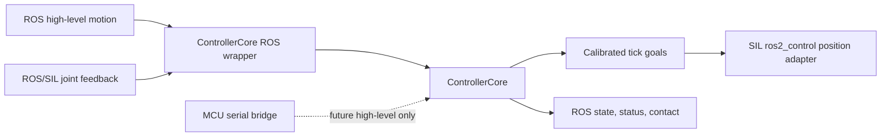

# ROS 2 Controller Interface Mapping

Status: interface design for `hexapod_src-4ju.13`, implemented for the initial
in-process ControllerCore ROS wrapper and SIL adapter in `hexapod_src-4ju.15`.
It does not connect a host to hardware, change the serial API, or claim that
current mock ros2_control behavior matches the robot.

Implementation update (`hexapod_src-4ju.15`):
`robot_ros_simulation/hexapod_msgs` now supplies `MotionCommand`,
`SilSafetyInput`, `JointCommand`, and `ControllerStatus`. The first SIL adapter
uses these messages with named `sensor_msgs/msg/JointState` feedback and writes
only to the mock position-controller topic when the core's motion gate is
open. `SilSafetyInput` is simulation-only and is not a serial or hardware
control API.

Implementation update (`hexapod_src-4ju.16`): `FootContact` and
`FootContactArray` now provide a simulation-only fused-contact input at
`~/sil_foot_contacts`. The adapter copies the source timestamp into each
portable `LegContactState`, rejects malformed leg maps and enum values, and
fails closed to unavailable zero-confidence feet for stale, faulted, absent,
or receipt-expired data. There is deliberately no simulated IMU message: the
portable controller contract has no IMU snapshot or consumer.

## Decisions

1. `ControllerCore` remains the high-level motion, safety, IK, ServoMap, and
   final tick-goal authority. ROS provides decoded intent and feedback snapshots
   to an adapter; it does not bypass the core with normal-motion joint commands.
2. The current `mock_components/GenericSystem`, `position_controller`,
   `velocity_controller`, and `joint_gui.py` are SIL visualization tools only.
   Their raw `Float64MultiArray` vectors must not be wired to a hardware bridge
   or treated as an MCU command interface.
3. ROS uses standard messages when they preserve meaning exactly. A custom
   motion command, safety/status, contact, and controller-output message set is
   required because no standard ROS message represents firmware gait parameters,
   bounded normalized twist, authority, fault, calibrated tick goals, and
   contact confidence together.
4. The later `hexapod_src-4ju.14` wrapper owns ROS-to-contract adaptation. The
   later `hexapod_src-be2.2` Jetson bridge maps approved high-level ROS messages
   to the existing MCU serial API; it must not duplicate the in-process SIL
   wrapper or add a raw-servo bypass.



## Canonical Joint Map

The firmware uses logical leg-major ordering with Mark III physical DXL IDs.
The runtime map is always the active `RobotConfig.servo_map`, not these default
IDs: calibration can change an ID, sign, trim, or travel limit without renaming
a ROS joint.

| Firmware leg | Role | Default DXL ID | ROS / URDF joint |
| ---: | --- | ---: | --- |
| 0 | coxa | 7 | `leg_1_coxa_joint` |
| 0 | femur | 9 | `leg_1_femur_joint` |
| 0 | tibia | 11 | `leg_1_tibia_joint` |
| 1 | coxa | 8 | `leg_2_coxa_joint` |
| 1 | femur | 10 | `leg_2_femur_joint` |
| 1 | tibia | 12 | `leg_2_tibia_joint` |
| 2 | coxa | 14 | `leg_3_coxa_joint` |
| 2 | femur | 16 | `leg_3_femur_joint` |
| 2 | tibia | 18 | `leg_3_tibia_joint` |
| 3 | coxa | 2 | `leg_4_coxa_joint` |
| 3 | femur | 4 | `leg_4_femur_joint` |
| 3 | tibia | 6 | `leg_4_tibia_joint` |
| 4 | coxa | 19 | `leg_5_coxa_joint` |
| 4 | femur | 3 | `leg_5_femur_joint` |
| 4 | tibia | 5 | `leg_5_tibia_joint` |
| 5 | coxa | 13 | `leg_6_coxa_joint` |
| 5 | femur | 15 | `leg_6_femur_joint` |
| 5 | tibia | 17 | `leg_6_tibia_joint` |

The name is the stable public key. All adapters must reject duplicate, missing,
or unknown names rather than relying on a publisher vector position. SIL may
publish the table in this leg-major order to match the current
`ros2_controllers.yaml`, but named message consumers must not depend on it.

`dxl::ServoMap` is the sole conversion authority:

$$
q_{rad} = sign \cdot (tick - 2048 - trim_{ticks}) \cdot \frac{2\pi}{4096}
$$

The wrapper must call `ServoMap::tickToAngle()` and `angleToTick()` rather than
copying this formula. The active config provides the sign, trim, DXL ID, and
travel limits. The current GUI's `inv` checkbox is a mock visualization control
and is not a calibration source.

## Frames and Units

The firmware mechanical body frame `B` uses $X$ right, $Y$ forward, and $Z$ up.
The command-frame boundary converts operator/ROS forward-left intent into this
frame. Firmware translations use millimeters and rotations use radians.

The intended ROS convention is REP-103:

| Concern | ROS representation | Authority / rule |
| --- | --- | --- |
| Body frame | `base_link` | Must coincide with firmware frame `B` before SIL/HIL integration. |
| Joint position | radians | `ServoMap` maps tick feedback to URDF-zero-relative angle. |
| Joint velocity | radians/second | Publish only after source units and conversion from the DXL model are validated. |
| Joint effort | SI torque, or empty | Current DXL load is a proxy, not a torque estimate. Do not publish it as effort. |
| Body pose offset | meters and radians in `MotionCommand` | Relative to neutral stance in `base_link`; it is not a world pose or TF transform. |
| Foot target | meters in `base_link` | Derived observation only; firmware maintains the authoritative millimeter IK values. |

The generated URDF currently contains CAD-oriented `base_link` geometry and no
verified `base_footprint` or `odom` relationship. The wrapper must not assume it
already has the same origin or handedness as `B`. A URDF/frame alignment check
is required before closed-loop simulation, and a physical calibration check is
required before HIL. Until a state estimator exists, no `odom -> base_link` TF
is published by this design.

`sensor_msgs/msg/JointState.header.frame_id` is empty. Joint names identify the
articulations and `robot_state_publisher` creates link transforms from them.

## ROS Interfaces

### High-level command input

`hexapod_msgs/msg/MotionCommand` is required because
`geometry_msgs/msg/Twist` and `TwistStamped` do not carry gait selection, body
height, stride, clearance, duty, speed scale, a body-pose offset, or a command
lifetime.

Proposed fields:

```text
std_msgs/Header header
uint32 sequence
builtin_interfaces/Duration valid_for
uint8 gait                         # 0 stand, 1 sit, 2 tripod, 3 ripple, 4 wave, 5 crawl
float32 body_height_m
float32 stride_length_m
float32 step_height_m
float32 duty_factor                # [0, 1]
float32 speed_scale                # [0, 1]
float32 normalized_vx              # [-1, 1], dimensionless
float32 normalized_vy              # [-1, 1], dimensionless
float32 normalized_wz              # [-1, 1], dimensionless
geometry_msgs/Vector3 body_translation_m
geometry_msgs/Vector3 body_rpy_rad
```

The wrapper clamps the message to the firmware envelope and converts meters to
the existing millimeter contract. It must reject unknown gait IDs and non-finite
values. `valid_for` is bounded to a future wrapper policy; its expiry causes a
safe zero/stand intent in SIL, but it never replaces MCU arming, RC kill,
watchdog, voltage, or DXL safety enforcement. A future autonomy layer may adapt
`TwistStamped` to this message only after its normalized-scale policy is
configured; `cmd_vel` is not a direct ControllerCore input.

### Controller output and simulation command

`hexapod_msgs/msg/JointCommand` is a wrapper output and traceable SIL boundary.
It carries the active config revision, source controller time, safety state,
goal validity, ordered names, calibrated goal ticks, radian positions, and
clamp flags. It is not a public actuator-control command.

The SIL adapter alone maps valid, motion-gated `JointCommand.position_rad` into
the current `/position_controller/commands` `Float64MultiArray`. It supplies all
18 values in the controller YAML order. The existing velocity controller is not
used by this path because ControllerCore emits position/tick goals, not a
velocity actuator command.

### Standard state output

Publish `sensor_msgs/msg/JointState` for state observations:

- `name`: all discovered/configured mapped ROS joint names;
- `position`: `ServoMap::tickToAngle()` result in radians;
- `velocity`: omitted until raw DXL velocity semantics are converted and tested;
- `effort`: omitted because present load/PWM is not a torque estimate.

For SIL, feedback comes from named ros2_control state interfaces at the 100 Hz
controller-manager rate and is converted back through `ServoMap::angleToTick()`
to populate the core's DXL snapshot. For hardware, feedback originates from the
MCU's DXL snapshot; ROS never writes target ticks back as simulated feedback.

### Status, contact, diagnostics, and IMU

Add the following custom messages because standard messages cannot preserve the
firmware semantics without inventing values:

| Topic | Type | Minimum contents | Rate |
| --- | --- | --- | --- |
| `~/controller_status` | `hexapod_msgs/msg/ControllerStatus` | safety state, fault reason, command source, motion gate, power/torque policy, config revision, source time | 10 Hz and on change |
| `~/sil_foot_contacts` | `hexapod_msgs/msg/FootContactArray` | simulation-only fused input: fixed six-leg map, AIR/NEAR/TOUCH/LOADED/RELEASE/STALE/FAULT, confidence, raw fields, source time, snapshot validity, and present mask | source-controlled; adapter expires an unrefreshed mailbox |
| `~/joint_command` | `hexapod_msgs/msg/JointCommand` | as above, including ticks and clamp/reachability results | 100 Hz SIL, 50-100 Hz target observation |
| `~/diagnostics` | `diagnostic_msgs/msg/DiagnosticArray` | human-readable bridge and transport health summary | 1-10 Hz and on fault |

`FootContactArray` carries no coordinates. Its fixed leg indices identify the
sensor attachment in the canonical leg-major map, so `header.frame_id` does not
name a physical coordinate frame. `source_time_ms` is the copied controller
timestamp; the ROS header is only for ROS ordering. The adapter measures
mailbox expiry from receipt time because a simulation source can have an
independent epoch.

No `/imu` topic is defined. The current simulation uses mock ros2_control and
the firmware contracts contain no IMU snapshot. Publishing synthetic zero IMU
values would falsely suggest a sensor source. Add `sensor_msgs/msg/Imu` only
when a specific simulated or physical source, mounting transform, covariance,
and timestamp policy are available.

## Timestamp Authority

`ControllerTime.now_ms` is the controller's unsigned monotonic source time. It
is used for safety/gait sequencing and remains independent of ROS time.

| Mode | Controller time | ROS header stamp |
| --- | --- | --- |
| SIL | Monotonic simulated/controller time | Wrapper's ROS clock at publication |
| MCU bridge | MCU uptime milliseconds | Host receipt/publication time until a time-sync model exists |
| Replay | Captured source milliseconds | Replay test has no ROS clock |

`ControllerStatus`, `FootContactArray`, and `JointCommand` retain
`source_time_ms` explicitly. The wrapper must not forge an MCU-to-ROS clock
conversion from a single receive timestamp. Header time is for ROS ordering;
source time is for controller causality and parity traces.

## Safety and Ownership Boundary

- ROS motion input is a request. Firmware still owns arm/disarm, E-stop,
  command-source arbitration, torque, DXL power, travel limits, gait timing,
  and final Sync Write eligibility.
- The initial wrapper exposes no raw DXL tick or direct joint-position command
  topic for normal motion. Existing maintenance commands remain maintenance-lock
  serial API operations and require their existing safety conditions.
- `JointCommand` is output-only. A bridge must reject any attempt to loop it
  back into target hardware as raw joint actuation.
- RC kill and MCU faults always win over ROS/Jetson requests. A stale ROS
  command is never an authority grant.

## Implementation Gates

Before `hexapod_src-4ju.14` creates the wrapper:

1. Create the `hexapod_msgs` definitions and test message-to-contract range,
   unit, and name validation without hardware.
2. Add a named joint-map test that checks all 18 URDF names against the active
   config mapping and rejects duplicates or gaps.
3. Resolve `hexapod_src-i5o`: mock position commands must update simulated joint
   state before ControllerCore can consume ros2_control feedback meaningfully.
4. Verify the `base_link` to firmware `B` frame alignment and each calibrated
   joint sign/zero on hardware before treating a visual pose as a physical pose.

This design intentionally leaves physical calibration, serial transport,
output-disabled HIL, and Jetson authority mechanics to their assigned tasks.