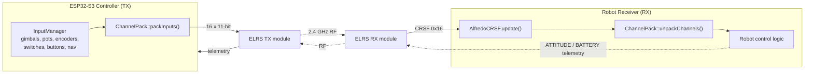

# ChannelPack

Shared channel packing / unpacking library for the **CRSF RC link** between the
ESP32-S3 controller (TX) and a custom robot receiver (RX).

`ChannelPack.h` is a single, dependency-free header. It packs **every input on the
controller** into the 16 channels of a standard CRSF `RC_CHANNELS_PACKED` (0x16)
frame, and unpacks them on the receiver side. Because the controller has far more
than 16 physical inputs, related digital inputs are **bit-packed** into shared
channels (switches, buttons, toggles, nav clusters).

> Copy this header verbatim into your receiver firmware so both ends agree on the
> exact channel map and bit layout. **If the two copies ever diverge, the link
> silently decodes garbage.**

---

## 1. System architecture



* **Transport:** CRSF over UART, **420000 baud, 8N1**.
* **Controller → Receiver:** `RC_CHANNELS_PACKED` (`0x16`) at 50 Hz (16 × 11-bit channels).
* **Receiver → Controller:** standard CRSF telemetry frames (attitude, battery).
* On the controller the link is **half-duplex** through an `SN74LVC1G125` tri-state
  buffer; on the receiver side your ELRS RX module presents a normal full-duplex
  CRSF UART, so a stock CRSF parser works unmodified.

---

## 2. Controller input capabilities

All inputs the controller exposes, and where each lands in the CRSF frame.

| Group | Inputs | Count | Source hardware | Channel(s) |
|-------|--------|-------|-----------------|------------|
| Gimbals | `LEFT_X`, `LEFT_Y`, `RIGHT_X`, `RIGHT_Y` | 4 | ADS1115 ADC (proportional) | CH1–CH4 |
| Potentiometers | `POT_1`, `POT_2` | 2 | ADS1115 ADC (proportional) | CH5–CH6 |
| Rotary encoders | `ENC1`, `ENC2` | 2 | MCP23017 (quadrature) | CH7–CH8 |
| 2-position switches | `SW_A`, `SW_B`, `SW_C`, `SW_D`, `SW_G`, `SW_H` | 6 | MCP23017 | CH9 (bitfield) |
| 3-position toggles | `SW_E`, `SW_F` | 2 | MCP23017 (2 pins each) | CH10 (bitfield) |
| Push buttons | `BTN_1`…`BTN_4` | 4 | MCP23017 | CH10 (bitfield) |
| 5-way nav switch 1 | `NAV1` U/D/L/R/C | 5 | MCP23017 | CH11 (bitfield) |
| 5-way nav switch 2 | `NAV2` U/D/L/R/C | 5 | MCP23017 | CH11 (bitfield) |
| Reserved | — | 5 | — | CH12–CH16 |

**Totals:** 6 proportional axes, 2 encoders, and 22 digital inputs (6 + 2×2 + 4 + 10)
mapped into 11 active channels, leaving 5 spare channels centered.

---

## 3. CRSF channel map

CRSF channels are **1-based** (`CH1`…`CH16`). The `CPACK_CH_*` macros are the
matching **0-based** array indices used by the library.

| CRSF ch | Index macro | Payload | Type | Encoding |
|--------:|-------------|---------|------|----------|
| CH1 | `CPACK_CH_LEFT_X`   (0) | Gimbal Left X  | proportional | `gimbalToCrsf` |
| CH2 | `CPACK_CH_LEFT_Y`   (1) | Gimbal Left Y  | proportional | `gimbalToCrsf` |
| CH3 | `CPACK_CH_RIGHT_X`  (2) | Gimbal Right X | proportional | `gimbalToCrsf` |
| CH4 | `CPACK_CH_RIGHT_Y`  (3) | Gimbal Right Y | proportional | `gimbalToCrsf` |
| CH5 | `CPACK_CH_POT1`     (4) | Potentiometer 1 | proportional | `potToCrsf` |
| CH6 | `CPACK_CH_POT2`     (5) | Potentiometer 2 | proportional | `potToCrsf` |
| CH7 | `CPACK_CH_ENC1`     (6) | Encoder 1 position | wrapped 11-bit | `encoderToCrsf` |
| CH8 | `CPACK_CH_ENC2`     (7) | Encoder 2 position | wrapped 11-bit | `encoderToCrsf` |
| CH9 | `CPACK_CH_SWITCHES` (8) | 6 × 2-pos switches | **bitfield** | `packSwitches` |
| CH10 | `CPACK_CH_BTN_TOGGLE` (9) | 4 buttons + 2 × 3-pos toggles | **bitfield** | `packButtonsToggles` |
| CH11 | `CPACK_CH_NAV`      (10) | 2 × 5-way nav switches | **bitfield** | `packNavSwitches` |
| CH12–CH16 | 11–15 | Reserved | centered | constant `992` |

> **Critical:** CH9–CH11 carry **raw integer bitfields**, not stick positions.
> Read them as raw 11-bit values and decode the bits — never scale them to µs or
> apply a deadzone.

---

## 4. Value encoding

### 4.1 CRSF level constants

| Constant | Value | Meaning |
|----------|------:|---------|
| `CPACK_CRSF_MIN` | `191` | minimum (≈1000 µs) |
| `CPACK_CRSF_MID` | `992` | center (≈1500 µs) |
| `CPACK_CRSF_MAX` | `1792` | maximum (≈2000 µs) |

Span = `CPACK_CRSF_MAX − CPACK_CRSF_MIN` = **1601**.

### 4.2 Proportional channels (gimbals & pots)

| Input | Controller range | CRSF range | Pack | Unpack |
|-------|------------------|-----------|------|--------|
| Gimbal | `-1000 … +1000` (0 = center) | `191 … 1792` | `gimbalToCrsf()` | `crsfToGimbal()` |
| Pot | `0 … 1000` | `191 … 1792` | `potToCrsf()` | `crsfToPot()` |

$$\text{crsf}_{gimbal} = \frac{(v + 1000)\,(1792 - 191)}{2000} + 191
\qquad
v_{gimbal} = \frac{(\text{crsf} - 191)\cdot 2000}{1601} - 1000$$

$$\text{crsf}_{pot} = \frac{v\,(1792 - 191)}{1000} + 191
\qquad
v_{pot} = \frac{(\text{crsf} - 191)\cdot 1000}{1601}$$

### 4.3 Encoder channels

Encoder position is reduced modulo 2048 into a wrapping 11-bit value:

```c
crsf = ((pos % 2048) + 2048) % 2048;   // 0 … 2047   (encoderToCrsf)
pos  = crsf & 0x7FF;                    // 0 … 2047   (crsfToEncoder)
```

Encoders are **relative**: track deltas frame-to-frame and handle the wrap at
0 ↔ 2047 yourself (a jump near the boundary is a wrap, not a 2047-step jump).

---

## 5. Bitfield channel layouts

All bitfields are LSB-first within the channel's 11 bits.

### CH9 — `CPACK_CH_SWITCHES` (`packSwitches` / `unpackSwitches`)

| Bit | Input | Values |
|----:|-------|--------|
| 0 | `SW_A` | 0 = off, 1 = on |
| 1 | `SW_B` | 0 = off, 1 = on |
| 2 | `SW_C` | 0 = off, 1 = on |
| 3 | `SW_D` | 0 = off, 1 = on |
| 4 | `SW_G` | 0 = off, 1 = on |
| 5 | `SW_H` | 0 = off, 1 = on |
| 6–7 | reserved | always 0 |

> `unpackSwitches()` fills a `bool[8]` array. Indices 0–5 are the switches above;
> indices 6–7 are reserved.

### CH10 — `CPACK_CH_BTN_TOGGLE` (`packButtonsToggles` / `unpackButtonsToggles`)

| Bit(s) | Input | Values |
|-------:|-------|--------|
| 0 | `BTN_1` | 0 = released, 1 = pressed |
| 1 | `BTN_2` | 0 = released, 1 = pressed |
| 2 | `BTN_3` | 0 = released, 1 = pressed |
| 3 | `BTN_4` | 0 = released, 1 = pressed |
| 4–5 | `SW_E` (3-pos) | 0 = UP, 1 = CENTER, 2 = DOWN |
| 6–7 | `SW_F` (3-pos) | 0 = UP, 1 = CENTER, 2 = DOWN |

3-position toggle values follow `Toggle3PosState_t`: `UP = 0`, `CENTER = 1`, `DOWN = 2`.

### CH11 — `CPACK_CH_NAV` (`packNavSwitches` / `unpackNavSwitches`)

The two 5-way nav switches. Direction order matches the `CPACK_NAV_*` indices.

| Bit | Input | | Bit | Input |
|----:|-------|---|----:|-------|
| 0 | `NAV1` UP     | | 5 | `NAV2` UP |
| 1 | `NAV1` DOWN   | | 6 | `NAV2` DOWN |
| 2 | `NAV1` LEFT   | | 7 | `NAV2` LEFT |
| 3 | `NAV1` RIGHT  | | 8 | `NAV2` RIGHT |
| 4 | `NAV1` CENTER | | 9 | `NAV2` CENTER |

> `unpackNavSwitches()` fills `bool nav[2][5]`: `nav[0]` = NAV1, `nav[1]` = NAV2,
> indexed by `CPACK_NAV_UP/DOWN/LEFT/RIGHT/CENTER` (0…4).

---

## 6. Library API reference

### 6.1 Data structure

```c
typedef struct {
    int16_t gimbal[4];   // -1000..+1000  (LX, LY, RX, RY)
    int16_t pot[2];      // 0..1000       (POT_1, POT_2)
    int32_t encoder[2];  // raw position  (ENC1, ENC2)
    bool    switches[8]; // SW_A,B,C,D,G,H = [0..5]; [6..7] reserved
    bool    buttons[4];  // BTN_1..BTN_4
    uint8_t toggles[2];  // SW_E, SW_F : 0=UP, 1=CENTER, 2=DOWN
    bool    nav[2][5];   // nav[switch][U,D,L,R,C]
} ChannelPackInputs_t;
```

### 6.2 TX side (controller — for reference)

| Function | Purpose |
|----------|---------|
| `void packInputs(const ChannelPackInputs_t* in, uint16_t ch[16])` | Pack all inputs into 16 channels; CH12–16 set to `CPACK_CRSF_MID`. |
| `uint16_t gimbalToCrsf(int16_t)` / `potToCrsf(int16_t)` | Proportional → CRSF. |
| `uint16_t encoderToCrsf(int32_t)` | Encoder → wrapped 11-bit. |
| `uint16_t packSwitches(const bool[8])` | Switch bitfield. |
| `uint16_t packButtonsToggles(const bool[4], const uint8_t[2])` | Buttons + toggles bitfield. |
| `uint16_t packNavSwitches(const bool[2][5])` | Nav bitfield. |

### 6.3 RX side (receiver)

| Function | Purpose |
|----------|---------|
| `void unpackChannels(const uint16_t ch[16], ChannelPackInputs_t* out)` | **Main entry point** — decode all 16 channels into the struct. |
| `int16_t crsfToGimbal(uint16_t)` | CRSF → `-1000..+1000`. |
| `int16_t crsfToPot(uint16_t)` | CRSF → `0..1000`. |
| `int32_t crsfToEncoder(uint16_t)` | CRSF → `0..2047`. |
| `void unpackSwitches(uint16_t, bool[8])` | Decode CH9. |
| `void unpackButtonsToggles(uint16_t, bool[4], uint8_t[2])` | Decode CH10. |
| `void unpackNavSwitches(uint16_t, bool[2][5])` | Decode CH11. |

In almost all cases you only need `unpackChannels()`; the per-field helpers exist
if you want to decode a single channel.

---

## 7. Receiver implementation guide

### 7.1 Required libraries

| Library | Required? | Why |
|---------|-----------|-----|
| **AlfredoCRSF** (bundled in `lib/`) | Yes | Parses incoming CRSF frames and sends telemetry. Any CRSF parser that exposes **raw 11-bit** channel values works. |
| **ChannelPack.h** (this header) | Yes | Decode the controller's channel/bit layout. Copy the file as-is. |
| `HardwareSerial` (Arduino core) | Yes | UART to the ELRS RX module. |
| **Adafruit BNO055** + **Adafruit Unified Sensor** | Optional | Only if sending attitude telemetry from a BNO055 IMU. |

For PlatformIO, a minimal receiver `platformio.ini` dependency list:

```ini
lib_deps =
    https://github.com/AlfredoSystems/AlfredoCRSF.git
    adafruit/Adafruit BNO055        ; optional, attitude telemetry
    adafruit/Adafruit Unified Sensor ; optional, BNO055 dependency
```

### 7.2 Reading inputs — minimal sketch

```cpp
#include <Arduino.h>
#include <HardwareSerial.h>
#include <AlfredoCRSF.h>
#include "ChannelPack.h"   // copied from the controller project

#define PIN_RX 7           // receiver UART <- ELRS RX TX pin
#define PIN_TX 8           // receiver UART -> ELRS RX RX pin

HardwareSerial crsfSerial(1);
AlfredoCRSF crsf;
ChannelPackInputs_t in;

void setup() {
    Serial.begin(115200);
    crsfSerial.begin(CRSF_BAUDRATE, SERIAL_8N1, PIN_RX, PIN_TX); // 420000 8N1
    crsf.begin(crsfSerial);
}

void loop() {
    crsf.update();                 // parse any pending CRSF frames

    // AlfredoCRSF stores RAW 11-bit channel values (191..1792), exactly what
    // ChannelPack expects. Copy all 16 channels (getChannel is 1-based).
    uint16_t ch[CPACK_NUM_CHANNELS];
    for (int i = 0; i < CPACK_NUM_CHANNELS; i++) {
        ch[i] = (uint16_t)crsf.getChannel(i + 1);
    }

    ChannelPack::unpackChannels(ch, &in);

    // ---- now use decoded inputs ----
    int16_t leftX  = in.gimbal[CPACK_CH_LEFT_X];   // -1000..+1000
    int16_t leftY  = in.gimbal[CPACK_CH_LEFT_Y];
    int16_t rightX = in.gimbal[CPACK_CH_RIGHT_X];
    int16_t rightY = in.gimbal[CPACK_CH_RIGHT_Y];
    int16_t pot1   = in.pot[0];                     // 0..1000

    bool armed     = in.switches[0];                // SW_A
    bool btn1      = in.buttons[0];                 // BTN_1
    uint8_t modeE  = in.toggles[0];                 // SW_E: 0/1/2
    bool navUp     = in.nav[0][CPACK_NAV_UP];       // NAV1 up
    int32_t enc1   = in.encoder[0];                 // 0..2047 (relative)
}
```

> **Channel value gotcha:** `ChannelPack` needs **raw 11-bit** values
> (`191…1792`). The bundled AlfredoCRSF returns exactly that from `getChannel()`
> (despite its header comment). If you swap in a different CRSF library that
> converts channels to **microseconds** (`988…2012`), use that library's raw /
> packed accessor instead — feeding µs into `unpackChannels()` corrupts the
> bitfield channels.

### 7.3 Failsafe

If `crsf.isLinkUp()` is false (no valid RC frame within the CRSF timeout), stop the
robot and ignore stale channel data. Do **not** act on the last received frame
indefinitely.

---

## 8. Telemetry: receiver → controller

The controller reads telemetry the receiver sends back up the link. Use
`crsf.queuePacket(CRSF_SYNC_BYTE, <type>, &payload, sizeof(payload))`; all
multi-byte fields are **big-endian**.

| Frame | Type | Consumed by controller | Notes |
|-------|-----:|------------------------|-------|
| `ATTITUDE` | `0x1E` | **Yes** — shown on the telemetry screen as pitch/roll/yaw in degrees | radians × 10000, big-endian `int16` per axis |
| `LINK_STATISTICS` | `0x14` | **Yes** — RSSI / LQ / SNR / RF mode / TX power | Normally generated by the ELRS link itself; you don't build this manually |
| `BATTERY_SENSOR` | `0x08` | Partially — the UI reserves a voltage field | voltage × 10, current × 10, capacity (mAh), remaining % |

### 8.1 Attitude (actively displayed)

The controller converts each axis with `degrees = raw / 10000 * (180/π)`, so send
the angle in **radians × 10000**:

```cpp
void sendAttitude(float pitchRad, float rollRad, float yawRad) {
    crsf_sensor_attitude_t a = {0};
    a.pitch = htobe16((int16_t)(pitchRad * 10000.0f));
    a.roll  = htobe16((int16_t)(rollRad  * 10000.0f));
    a.yaw   = htobe16((int16_t)(yawRad   * 10000.0f));
    crsf.queuePacket(CRSF_SYNC_BYTE, CRSF_FRAMETYPE_ATTITUDE, &a, sizeof(a));
}
```

With a BNO055 you can read a `Vector` of Euler angles (degrees), convert to radians,
and pass them in.

### 8.2 Battery

```cpp
void sendBattery(float volts, float amps, uint32_t mah, uint8_t pct) {
    crsf_sensor_battery_t b = {0};
    b.voltage   = htobe16((uint16_t)(volts * 10.0f));
    b.current   = htobe16((uint16_t)(amps  * 10.0f));
    b.capacity  = htobe16((uint16_t)mah) << 8;   // 16 of 24 bits
    b.remaining = pct;
    crsf.queuePacket(CRSF_SYNC_BYTE, CRSF_FRAMETYPE_BATTERY_SENSOR, &b, sizeof(b));
}
```

Send telemetry at a modest rate (e.g. attitude ≤ 50 Hz, battery 1–5 Hz) so it does
not crowd the RC uplink.

---

## 9. Constants quick reference

| Macro | Value | Meaning |
|-------|------:|---------|
| `CPACK_NUM_CHANNELS` | 16 | Total CRSF channels |
| `CPACK_CRSF_MIN` / `MID` / `MAX` | 191 / 992 / 1792 | CRSF level endpoints |
| `CPACK_CH_LEFT_X … RIGHT_Y` | 0–3 | Gimbal indices |
| `CPACK_CH_POT1 / POT2` | 4 / 5 | Pot indices |
| `CPACK_CH_ENC1 / ENC2` | 6 / 7 | Encoder indices |
| `CPACK_CH_SWITCHES` | 8 | Switch bitfield channel |
| `CPACK_CH_BTN_TOGGLE` | 9 | Button + toggle bitfield channel |
| `CPACK_CH_NAV` | 10 | Nav bitfield channel |
| `CPACK_NAV_UP/DOWN/LEFT/RIGHT/CENTER` | 0–4 | Nav direction indices |

---

## 10. Gotchas

* **Keep both copies of `ChannelPack.h` identical.** A mismatched channel or bit
  layout decodes silently into wrong inputs.
* **Bitfield channels (CH9–CH11) are not sticks.** Never scale them to µs or apply
  deadzones; decode the bits.
* **Encoders are relative and wrap** at 0 ↔ 2047. Work in deltas.
* **`SW_E` / `SW_F` are 3-position** (values 0/1/2), packed in CH10 — not in the
  CH9 switch bitfield (bits 6–7 of CH9 are reserved).
* **CH12–CH16 are reserved** and always centered (`992`); safe to use for future
  expansion if you update both ends.
* **Honor failsafe** via `isLinkUp()` before acting on channel data.
